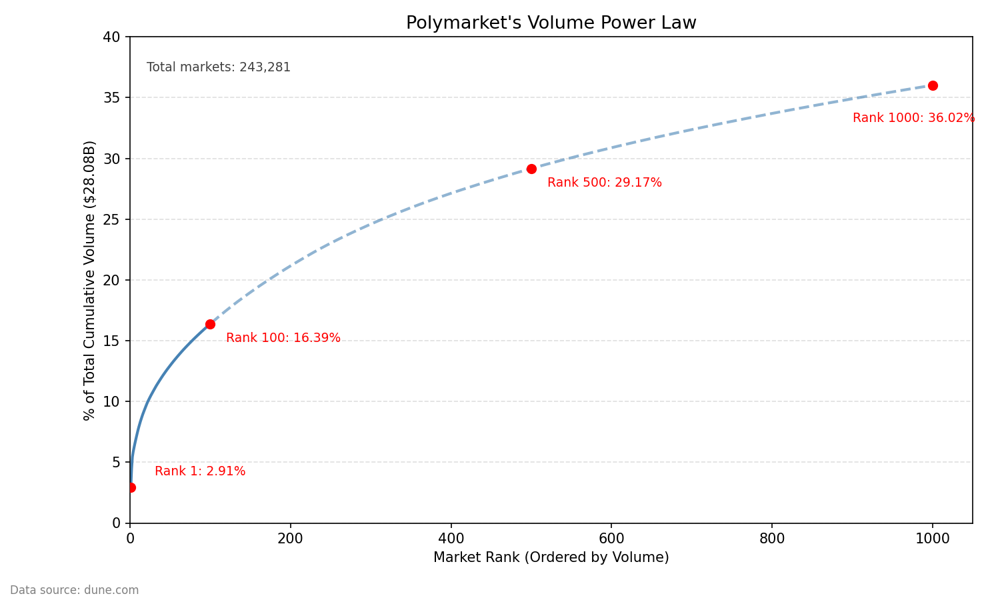
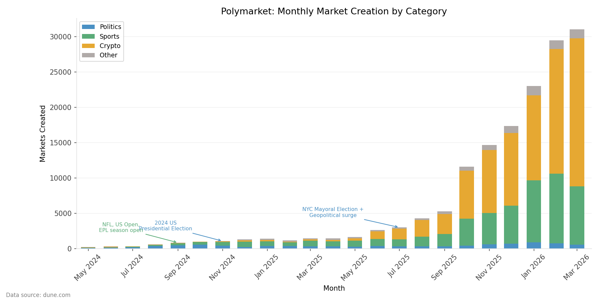
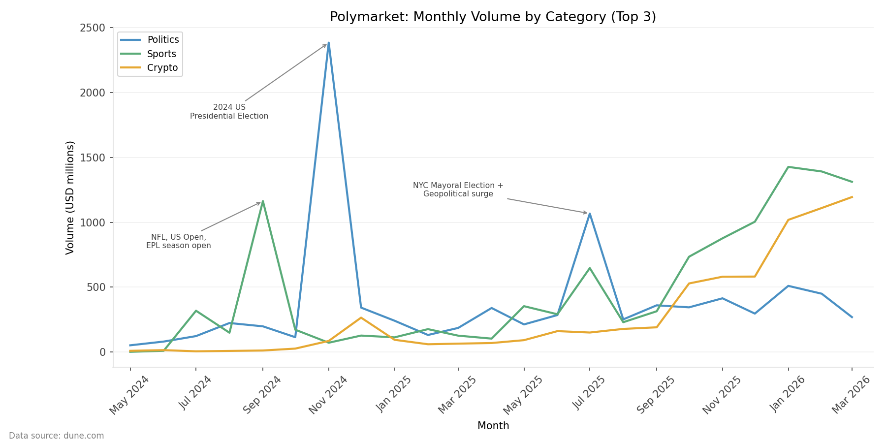
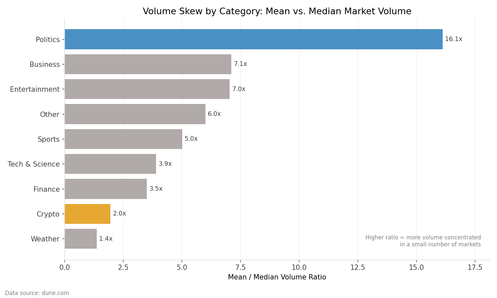

# Decoding Polymarket: A Pipeline for Prediction Market Analytics

## Overview

Polymarket's growth has been explosive since it came into the public eye during the 2024 
election cycle. This project has two primary aims:

1. Analyze Polymarket at the market and category level
2. Establish a foundation for future analysis of user-level behavior

**What this project answers (Layer 1):**
- Where is volume concentrated on Polymarket?
- Which categories dominate trading activity, and how has that changed over time?
- How has market creation grown across categories?
- Within categories, how skewed is volume toward a small number of markets?

**What this project is building toward (Layer 2):**
- Have high-profile markets driven durable user retention?
- Do users specialize in specific categories or trade broadly?
- What does the trading lifecycle look like after a user exits a position?

---
## Data Extraction & Limitations

This analysis is constrained by the cost of extracting historical trade data via the Dune API. As a result, the dataset is filtered to include only markets with a lifetime trading volume (LTV) of at least $10,000.

### Dataset summary:
	•	~580,000 markets existed between May 2024 and April 9th, 2026
	•	Total volume over this period: $29.5B
	•	Median market volume: ~$2,500
	•	~160,000 markets exceed the $10,000 LTV threshold
	•	The remaining ~420,000 markets account for ~3% of total volume

This filtering removes a large number of low-activity markets while preserving the vast majority of economic activity.

⸻

### Interpretation considerations

All concentration, skew, and distribution metrics in this analysis are computed on the filtered market universe. As a result, these measures should be interpreted as describing active liquidity-bearing markets, rather than the full population of all created markets.

This distinction is important because Polymarket exhibits extreme long-tail behavior: the majority of markets contribute negligible volume, while a small subset drives nearly all trading activity. The filtering therefore compresses the extreme tail of the distribution, making the observed curves appear less skewed than the true underlying population.

Where relevant, results should be interpreted as conditional on market participation (i.e., markets with meaningful trading activity), rather than unconditional across all market creation events.
____

## Methodology

To answer these questions, it is first necessary to construct a reliable view of trading 
activity from raw on-chain data. This requires understanding how Polymarket trading works, 
what data is emitted during execution, how that data is indexed by Dune, and how it ultimately 
takes shape in analytical datasets.

### What is Polymarket?

Polymarket is a central limit order book (CLOB) style prediction market that uses a low-cost 
EVM-compatible blockchain for settlement. It separates trading into two layers:

1. **Off-chain:** order matching (fast and inexpensive)
2. **On-chain:** settlement (secure, verifiable, immutable)

This hybrid exchange model combines a centralized matching engine with decentralized settlement 
and custody. The result is a system that is both performant and trust-minimized.

### How Polymarket Trading Works

A typical trade follows this lifecycle:

1. A user creates a limit order off-chain using an EIP-712 signed message (price, size, expiration)
2. The Polymarket operator matches compatible orders off-chain
3. Once matched, the operator submits the trade to the exchange contract on-chain
4. The contract verifies signatures, executes atomic token swaps (USDC.e ↔ conditional outcome 
   tokens via the Gnosis Conditional Token Framework), deducts fees, and emits execution events

### Event Anatomy: OrderFilled

The primary data used in this analysis comes from the `OrderFilled` event emitted by the 
NegRisk and CTF exchange contracts. This event represents the fundamental unit of execution 
on-chain:

- It is emitted once per maker order involved in a trade
- It is also emitted once from the taker perspective per transaction

As a result, a single trade can generate multiple event records depending on how many maker 
orders were filled.

### Taker-Sided Deduplication

A key challenge in the raw data is that each trade is represented multiple times, leading to 
double-counting if aggregated naively. This duplication arises because trades are recorded from 
both maker and taker perspectives.

**Maker-side OrderFilled events (1+ per trade):**
- Emitted once per maker, multiple times for partial fills
- Represents fragmented execution across liquidity sources

**Taker-side OrderFilled event (exactly one per transaction):**
- maker = user consuming liquidity
- taker = exchange contract (CTF or NegRisk)
- Represents the full trade from the taker's perspective

Because the exchange contract addresses are constant across all trades, they provide a reliable 
filter. This project retains only taker-sided events, which collapse multiple maker fills into 
a single record and eliminate duplication.

### Pipeline Architecture
Layer 1 — System
User → Signed Order → Off-chain Matching → On-chain Settlement → OrderFilled Events
Layer 2 — Data & Analytics
OrderFilled Events → Dune → Taker-Side Filtering → DuckDB + dbt → Market-Level Aggregations
Layer 3 — Visualization
Mart Tables → CSV Exports → Python (Pandas, Matplotlib) → Charts


### Data Constraints

This analysis focuses on the 164,676 markets with lifetime volume (LTV) greater than $10,000, 
which account for 97.3% of Polymarket's $29.5B in cumulative trading volume. Markets below 
this threshold are excluded to reduce extract size and filter noise.

> **Note:** Monthly volume figures reflect markets grouped by start date rather than trade 
> execution date. Long-duration futures markets may appear in earlier months than their peak 
> trading activity. This limitation is most pronounced for Sports, where season-long futures 
> open months before the events they track.

---

## Key Findings

### Volume Concentration

Polymarket has processed $29.5B in cumulative trading volume across 575,658 markets 
(as of April 8, 2026). The median lifetime volume per market is $2,433 — a figure that 
immediately signals how skewed the distribution is.



| Bucket | Market Count | Volume ($M) | % of Total Volume |
|--------|-------------|-------------|-------------------|
| Top 1% | 5,757 | $17,929 | 60.75% |
| Top 5% | 28,783 | $23,386 | 79.23% |
| Top 10% | 57,566 | $25,762 | 87.29% |
| Top 25% | 143,915 | $28,463 | 96.44% |
| Bottom 50% | 287,829 | $155 | 0.53% |

The top 1% of markets — just 5,757 out of 575,658 — account for over 60% of all volume. 
The bottom 50%, nearly 288,000 markets, collectively trade just $155M, less than many 
individual top-tier markets.

This is not simply a noise problem. Even after filtering to the 164,676 active markets 
(LTV > $10,000), concentration persists:

| Bucket | Market Count | Volume ($M) | % of Active Markets | % of Volume |
|--------|-------------|-------------|---------------------|-------------|
| Top 1% | 1,563 | $13,963 | 1% | 49.72% |
| Top 5% | 7,815 | $18,915 | 5% | 67.36% |
| Top 10% | 15,629 | $21,226 | 10% | 75.58% |
| Top 25% | 39,071 | $24,184 | 25% | 86.12% |
| Bottom 50% | 78,141 | $1,588 | 50% | 5.65% |

Within the active market universe, the top 1% still captures nearly half of all volume. 
Prediction markets do not distribute activity evenly — a small number of high-stakes, 
high-visibility events capture the vast majority of trader attention and liquidity.

---

### Category Concentration

Trading activity is dominated by three categories — Sports, Politics, and Crypto — which 
together account for 94.58% of all volume.

| Category | Market Count | Volume ($M) | % of Markets | % of Volume |
|----------|-------------|-------------|--------------|-------------|
| Sports | 51,413 | $11,126 | 32.90% | 39.62% |
| Politics | 9,974 | $8,913 | 6.38% | 31.74% |
| Crypto | 85,942 | $6,520 | 54.99% | 23.22% |
| Entertainment | 2,088 | $715 | 1.34% | 2.55% |
| Business | 489 | $209 | 0.31% | 0.74% |
| Weather | 2,283 | $182 | 1.46% | 0.65% |
| Finance | 2,764 | $173 | 1.77% | 0.62% |
| Tech & Science | 688 | $171 | 0.44% | 0.61% |
| Other | 642 | $74 | 0.41% | 0.26% |

The most striking dynamic is the inversion between Crypto and Politics. Crypto accounts for 
55% of all active markets but only 23% of volume. Politics is the mirror image: 6.4% of 
markets but 31.7% of volume — a ratio of nearly 5x. A relatively small number of high-stakes 
political events generate outsized trader interest relative to the volume of markets created.

Sports sits between the two — 33% of markets, 40% of volume — a modest outperformance driven 
by a consistent pipeline of high-liquidity tournament and championship markets.

---

### Market Creation Growth



Market creation has grown roughly 15x from May 2024 to March 2026, with composition shifting 
dramatically. By early 2026, monthly market creation surpassed 40,000 — driven almost entirely 
by Crypto and Sports.

**Sports has scaled consistently.** From near zero in mid-2024, Sports market creation has 
grown steadily and now accounts for the largest share of new markets by count, reflecting 
systematic expansion into game-level and tournament markets across football, soccer, basketball, 
and esports.

**Crypto has exploded.** Crypto market creation was negligible through most of 2024 and began 
accelerating sharply in mid-2025, driven by recurring short-duration price prediction markets — 
whether Bitcoin, Ethereum, or Solana will be up or down within a given window.

**Politics has not scaled.** Despite generating the most trading volume per market, Politics 
market creation has remained relatively flat. High-stakes political events are episodic by 
nature and cannot be manufactured at scale the way sports fixtures or crypto price windows can.

---

### Volume Growth by Category



While market creation tells the supply story, volume tells the demand story — and the two 
diverge significantly by category.

Politics generated the most trading volume through 2024, peaking at $2.38B in November 2024 
during the US Presidential Election — the largest volume month in Polymarket's history. After 
the election, Politics volume collapsed before recovering to a steady $300-500M per month 
baseline driven by Fed rate decisions, geopolitical events, and the NYC mayoral election in 
July 2025.

Sports volume is event-driven and lumpy. The September 2024 spike reflects the convergence 
of the NFL season opener, US Open tennis, and EPL kickoff. From mid-2025 onward, Sports has 
grown into the highest-volume category on a sustained basis, reaching $1.4B in January 2026.

Crypto volume was negligible through most of 2024 and began growing alongside the broader 
crypto bull market in late 2024. By early 2026 it reached $1.2B monthly. Unlike Politics and 
Sports, Crypto volume growth appears structural rather than event-driven.

---

### Volume Skew Within Categories



The mean/median volume ratio measures how concentrated trading activity is within a category. 
A ratio of 1.0 would indicate perfectly even distribution. In practice, no category comes close.

| Category | Mean/Median Ratio |
|----------|------------------|
| Politics | 16.1x |
| Business | 7.1x |
| Entertainment | 7.0x |
| Other | 6.0x |
| Sports | 5.0x |
| Tech & Science | 3.9x |
| Finance | 3.5x |
| Crypto | 2.0x |
| Weather | 1.4x |

Politics at 16.1x is the most extreme — more than double the next category. This is the 
mathematical signature of the election effect: a small number of massive markets pull the 
category mean far above the median. Politics markets are not uniformly large — they are 
bimodal, with a long tail of small markets and a handful of giants.

Crypto at 2.0x is the most evenly distributed category, reflecting the commoditized nature 
of recurring short-duration price markets. Weather at 1.4x is the flattest of all — daily 
temperature markets are uniform by design.

---

### Summary

The findings across all four dimensions point to the same underlying dynamic: Polymarket's 
activity is driven by a small number of high-stakes, high-visibility events. The 2024 US 
Presidential Election is the clearest single example — the Trump market alone generated $818M 
in volume, roughly 2.8% of all platform volume in a single market, and November 2024 was the 
highest-volume month in Polymarket's history. But the election is not an anomaly — it is an 
extreme expression of a pattern that holds at every level of analysis: across markets, across 
categories, and within categories.

---

## Reproducing This Analysis

See [SETUP.md](SETUP.md) for full setup and reproduction instructions.

---

## Project Structure
```
polymarket-analytics/
├── data/
│   └── raw/                        # Raw CSVs extracted from Dune (gitignored)
│       ├── market_trades.csv
│       └── market_metadata.csv
├── polymarket_dbt/
│   ├── models/
│   │   ├── staging/
│   │   │   ├── stg_market_metadata.sql     # Cleans and types market metadata
│   │   │   └── stg_market_trades.sql       # Cleans and deduplicates trade events
│   │   ├── intermediate/
│   │   │   └── int_markets_categorized.sql # Joins trades, metadata, LLM categories
│   │   └── marts/
│   │       ├── fct_markets.sql
│   │       ├── mart_category_concentration.sql
│   │       ├── mart_category_power_law.sql
│   │       ├── mart_category_volume_summary.sql
│   │       ├── mart_market_creation.sql
│   │       ├── mart_market_duration.sql
│   │       ├── mart_market_summary.sql
│   │       ├── mart_power_law_volume.sql
│   │       ├── mart_top_markets_all_time.sql
│   │       ├── mart_top_markets_by_category.sql
│   │       ├── mart_volume_distribution.sql
│   │       └── top_200_markets.sql
│   └── dbt_project.yml
├── exports/                        # Mart CSVs for visualization (gitignored)
├── scripts/
│   ├── dune_extract.py             # Pulls raw data from Dune API
│   ├── export_marts.py             # Auto-exports all mart_ tables to CSV
│   ├── load_raw.py                 # Loads raw CSVs into DuckDB
│   ├── power_law_chart.py
│   ├── markets_created_monthly_chart.py
│   ├── monthly_volume_by_category_chart.py
│   └── volume_skew_category_chart.py
├── assets/
│   └── charts/                     # Generated chart PNGs (committed)
│       ├── market_creation_chart.png
│       ├── volume_by_category_chart.png
│       ├── volume_skew_chart.png
│       └── power_law_chart.png
├── dev.duckdb                      # Local DuckDB database (gitignored)
├── .gitignore
├── README.md
└── SETUP.md
```
