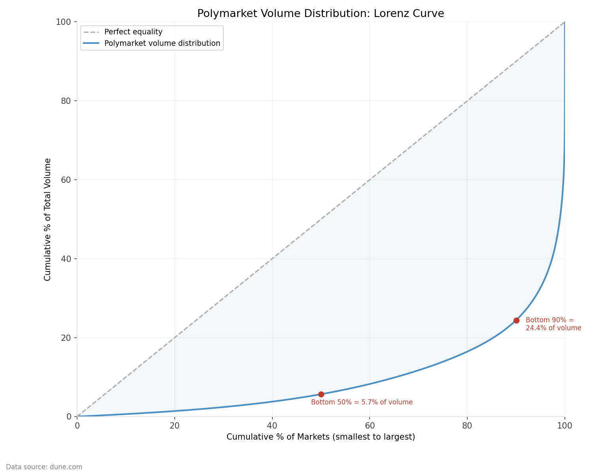
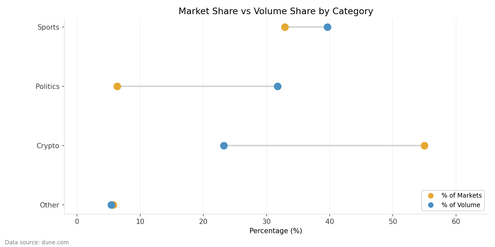

# Decoding Polymarket: A Pipeline for Prediction Market Analytics


## Overview

Polymarket's $29.5B in lifetime trading volume follows a sharp power law: the top 1,000 markets account for $13.25B (45%), while the long tail of markets sees negligible activity. This project builds a dbt pipeline on data extracted from Dune Analytics to quantify that concentration, segment market behavior, and surface the structural patterns driving Polymarket's liquidity distribution.

### Key findings:
- Volume concentration is extreme — the top 1% of markets capture over 60% of all trading volume, and the bottom 50% collectively account for just $155M
- Market creation has scaled 15x since May 2024, but liquidity has not followed proportionally. Speculator attention clusters around high-profile, uncertain events while the expanding long tail remains illiquid
- Category dynamics diverge sharply: Politics generates 5x more volume per market than Crypto, yet Crypto accounts for 55% of all market creation — a supply/demand mismatch that defines the platform's structure

This exploratory analysis has two aims:

1. Analyze Polymarket at the market and category level
2. Establish a foundation for future analysis of user-level behavior

**What this project answers (Layer 1):**
- Where is volume concentrated on Polymarket?
- Which categories dominate trading activity, and how has that changed over time?
- How has market creation grown across categories?
- Within categories, how skewed is volume toward a small number of markets?

**What this project is building toward (Layer 2):**
- Have high-profile markets driven durable user retention?
- Do users specialize in specific categories or trade broadly?
- What does the trading lifecycle look like after a user exits a position?

---

## Data Extraction & Limitations

This analysis is constrained by the cost of extracting historical trade data via the Dune API. The dataset is filtered to include only markets with a lifetime trading volume (LTV) of at least $10,000.

### Dataset summary:
- ~580,000 markets existed between May 2024 and April 9th, 2026
- Total volume over this period: $29.5B
- Median market volume: ~$2,500
- ~156,000 markets exceed the $10,000 LTV threshold
- The remaining ~424,000 markets account for ~3% of total volume

This filtering removes a large number of low-activity markets while preserving 97% of economic activity. All concentration, skew, and distribution metrics are computed on this filtered universe. Because Polymarket exhibits extreme long-tail behavior, the true full-population distribution is even more skewed than what appears here.

> **Note:** Where relevant, results should be interpreted as describing active, liquidity-bearing markets rather than the full population of all created markets.

---

## Methodology

Constructing a reliable view of trading activity from raw on-chain data requires understanding how Polymarket executes trades, what data is emitted, and how duplication arises in the event log.

### Platform Architecture

Polymarket is a hybrid exchange: orders are matched off-chain for speed, then settled on-chain (Polygon) for verifiability. A trade follows this lifecycle:

1. A user creates a signed limit order off-chain
2. The Polymarket operator matches compatible orders
3. The matched trade is submitted to the exchange contract on-chain
4. The contract verifies signatures, executes atomic token swaps (USDC.e ↔ conditional outcome tokens via the Gnosis CTF), deducts fees, and emits execution events

### Event Anatomy & Deduplication

The primary data source is the `OrderFilled` event emitted by the NegRisk and CTF exchange contracts. A key challenge: each trade generates multiple event records — one per maker order filled, plus one from the taker perspective — leading to double-counting if aggregated naively.

**Maker-side events (1+ per trade):**
- Emitted once per maker, multiple times for partial fills
- Represents fragmented execution across liquidity sources

**Taker-side event (exactly one per transaction):**
- `maker` = user consuming liquidity
- `taker` = exchange contract address (CTF or NegRisk)
- Represents the complete trade from the initiator's perspective

Because the exchange contract addresses are constant across all trades, they provide a reliable filter. This pipeline retains only taker-sided events, collapsing multiple maker fills into a single record and eliminating duplication.

### Pipeline Architecture

```
Layer 1 — System
User → Signed Order → Off-chain Matching → On-chain Settlement → OrderFilled Events

Layer 2 — Data & Analytics
OrderFilled Events → Dune → Taker-Side Filtering → DuckDB + dbt → Market-Level Aggregations

Layer 3 — Visualization
Mart Tables → CSV Exports → Python (Pandas, Matplotlib) → Charts
```

### Scope

This analysis focuses on the 156,283 markets with LTV greater than $10,000, accounting for 97.3% of Polymarket's $29.5B in cumulative trading volume.

> **Note:** Monthly volume figures reflect markets grouped by start date rather than trade execution date. Long-duration futures markets may appear in earlier months than their peak trading activity. This is most pronounced for Sports, where season-long futures open months before the events they track.

---

## Findings

### Volume Concentration

Polymarket has processed $29.5B in cumulative trading volume across 575,658 markets (as of April 8, 2026). The median lifetime volume per market is $2,433.


| Bucket | Market Count | Volume ($M) | % of Total Volume |
|--------|-------------|-------------|-------------------|
| Top 1% | 5,757 | $17,929 | 60.75% |
| Top 5% | 28,783 | $23,386 | 79.23% |
| Top 10% | 57,566 | $25,762 | 87.29% |
| Top 25% | 143,915 | $28,463 | 96.44% |
| Bottom 50% | 287,829 | $155 | 0.53% |

The top 1% of markets — 5,757 out of 575,658 — account for over 60% of all volume. The bottom 50%, nearly 288,000 markets, collectively trade less than many individual top-tier markets.

Even after filtering to the 156,283 active markets (LTV > $10,000), the concentration persists:


| Bucket | Market Count | Volume ($M) | % of Active Markets | % of Volume |
|--------|-------------|-------------|---------------------|-------------|
| Top 1% | 1,563 | $13,963 | 1% | 49.72% |
| Top 5% | 7,815 | $18,915 | 5% | 67.36% |
| Top 10% | 15,629 | $21,226 | 10% | 75.58% |
| Top 25% | 39,071 | $24,184 | 25% | 86.12% |
| Bottom 50% | 78,141 | $1,588 | 50% | 5.65% |

Within the active market universe, the top 1% still captures nearly half of all volume. Prediction markets do not distribute activity evenly — a small number of high-stakes, high-visibility events capture the vast majority of trader attention and liquidity.

### Category Concentration

The distribution of volume across categories reveals where trader attention actually flows, and where it doesn't.

Trading activity is dominated by three categories — Sports, Politics, and Crypto — which together account for 94.58% of all volume.


| Category | Market Count | Volume ($M) | % of Markets | % of Volume |
|----------|-------------|-------------|--------------|-------------|
| Sports | 51,413 | $11,126 | 32.90% | 39.62% |
| Politics | 9,974 | $8,913 | 6.38% | 31.74% |
| Crypto | 85,942 | $6,520 | 54.99% | 23.22% |
| Entertainment | 2,088 | $715 | 1.34% | 2.55% |
| Business | 489 | $209 | 0.31% | 0.74% |
| Weather | 2,283 | $182 | 1.46% | 0.65% |
| Finance | 2,764 | $173 | 1.77% | 0.62% |
| Tech & Science | 688 | $171 | 0.44% | 0.61% |
| Other | 642 | $74 | 0.41% | 0.26% |

The most striking dynamic is the inversion between Crypto and Politics. Crypto accounts for 55% of all active markets but only 23% of volume. Politics is the mirror image: 6.4% of markets but 31.7% of volume — a ratio of nearly 5x. A relatively small number of high-stakes political events generate outsized trader interest relative to the volume of markets created.

Sports sits between the two — 33% of markets, 40% of volume — a modest outperformance driven by a consistent pipeline of high-liquidity tournament and championship markets.

### Market Creation Growth


Market creation has grown roughly 15x from May 2024 to March 2026, with composition shifting dramatically. By early 2026, monthly market creation surpassed 40,000 — driven almost entirely by Crypto and Sports.

**Sports has scaled consistently.** From near zero in mid-2024, Sports market creation has grown steadily and now accounts for the largest share of new markets by count, reflecting systematic expansion into game-level and tournament markets across football, soccer, basketball, and esports.

**Crypto has exploded.** Crypto market creation was negligible through most of 2024 and began accelerating sharply in mid-2025, driven by recurring short-duration price prediction markets — whether Bitcoin, Ethereum, or Solana will be up or down within a given window.

**Politics has not scaled.** Despite generating the most trading volume per market, Politics market creation has remained relatively flat. High-stakes political events are episodic by nature and cannot be manufactured at scale the way sports fixtures or crypto price windows can.

### Volume Growth by Category


While market creation tells the supply story, volume tells the demand story — and the two diverge significantly.

Politics generated the most trading volume through 2024, peaking at $2.38B in November 2024 during the US Presidential Election — the largest volume month in Polymarket's history. After the election, Politics volume collapsed before recovering to a steady $300–500M per month baseline driven by Fed rate decisions, geopolitical events, and the NYC mayoral election in July 2025.

Sports volume is event-driven and lumpy. The September 2024 spike reflects the convergence of the NFL season opener, US Open tennis, and EPL kickoff. From mid-2025 onward, Sports has grown into the highest-volume category on a sustained basis, reaching $1.4B in January 2026.

Crypto volume was negligible through most of 2024 and began growing alongside the broader crypto bull market in late 2024. By early 2026 it reached $1.2B monthly. Unlike Politics and Sports, Crypto volume growth appears structural rather than event-driven.

### Volume Skew Within Categories


The concentration pattern holds at the platform level, but it is not uniform across categories. The mean/median volume ratio measures how skewed trading activity is within each category — a ratio of 1.0 would indicate perfectly even distribution.

Politics at 16.1x is the most extreme — more than double the next category. This is the mathematical signature of the election effect: a small number of massive markets pull the category mean far above the median. Politics markets are not uniformly large — they are bimodal, with a long tail of small markets and a handful of giants.

Crypto at 2.0x is the most evenly distributed category, reflecting the commoditized nature of recurring short-duration price markets. Weather at 1.4x is the flattest — daily temperature markets are uniform by design.

---

## Summary

The findings across all four dimensions — overall concentration, category distribution, creation growth, and intra-category skew — point to the same underlying dynamic: Polymarket's activity is driven by a small number of high-stakes, high-visibility events. The 2024 US Presidential Election is the clearest single example — the Trump market alone generated $818M in volume, roughly 2.8% of all platform activity in a single market, and November 2024 was the highest-volume month in Polymarket's history. But the election is not an anomaly — it is an extreme expression of a pattern that holds at every level of analysis.

Meanwhile, market creation has scaled 15x, but volume has not kept pace. Polymarket can manufacture supply cheaply — particularly in Crypto and Sports — but speculator demand remains concentrated. The platform's growth story is as much about the expanding gap between market creation and liquidity as it is about raw volume.

Layer 2 will examine whether this concentration extends to the trader level — whether the same power law that governs markets also governs the users trading them.

---

## Reproducing This Analysis

See [SETUP.md](SETUP.md) for full setup and reproduction instructions.

---

## Project Structure
```
polymarket-analytics/
├── data/
│   └── raw/                        # Raw CSVs extracted from Dune (gitignored)
│       ├── market_trades.csv
│       └── market_metadata.csv
├── polymarket_dbt/
│   ├── models/
│   │   ├── staging/
│   │   │   ├── stg_market_metadata.sql     # Cleans and types market metadata
│   │   │   └── stg_market_trades.sql       # Cleans and deduplicates trade events
│   │   ├── intermediate/
│   │   │   └── int_markets_categorized.sql # Joins trades, metadata, LLM categories
│   │   └── marts/
│   │       ├── fct_markets.sql
│   │       ├── mart_category_concentration.sql
│   │       ├── mart_category_volume_summary.sql
│   │       ├── mart_market_creation.sql
│   │       ├── mart_market_summary.sql
│   │       ├── mart_power_law_volume.sql
│   │       ├── mart_market_duration.sql
│   │       ├── mart_top_markets_all_time.sql
│   │       └── mart_volume_distribution.sql
│   └── dbt_project.yml
├── exports/                        # Mart CSVs for visualization (gitignored)
├── scripts/
│   ├── dune_extract.py             # Pulls raw data from Dune API
│   ├── export_marts.py             # Auto-exports all mart_ tables to CSV
│   ├── load_raw.py                 # Loads raw CSVs into DuckDB
│   ├── power_law_chart.py
│   ├── markets_created_monthly_chart.py
│   ├── monthly_volume_by_category_chart.py
│   └── volume_skew_category_chart.py
├── assets/
│   └── charts/                     # Generated chart PNGs (committed)
│       ├── market_creation_chart.png
│       ├── volume_by_category_chart.png
│       ├── volume_skew_chart.png
│       ├── power_law_chart.png
│		├── lorenz_curve.png
│       └── category_dumbell.png
├── dev.duckdb                      # Local DuckDB database (gitignored)
├── .gitignore
├── README.md
└── SETUP.md
```
